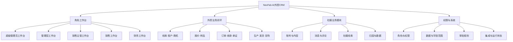
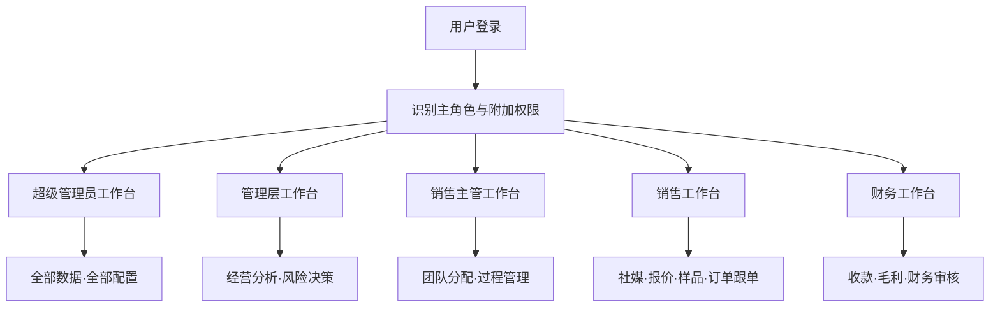
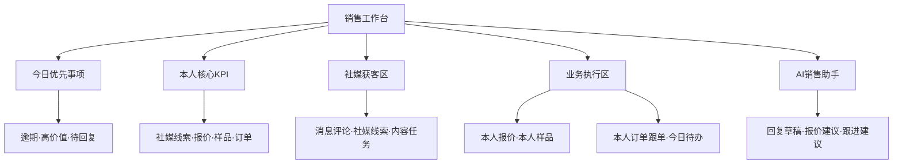

# NexFab CRM V4.1：角色工作台、社媒模块与 AI 开发提示词

版本：V4.1  
日期：2026-08-13

## 一、最新产品结论

系统采用“一套CRM底座 + 五类角色工作台 + 一个社媒业务模块 + 统一权限中心”。

不再要求所有人员共用同一个工作台。用户登录后，系统根据角色、岗位权限和数据范围，进入对应工作台；各工作台复用同一套业务数据与组件，但首页模块、指标、操作入口和可见数据不同。

明确角色：

1. 超级管理员。
2. 管理层。
3. 销售主管。
4. 销售。
5. 财务。

核心规则：

- 超级管理员具有全部模块、全部数据、全部操作、权限配置和系统配置权限。
- 其他角色采用CRM常见的RBAC权限控制，并叠加本人/团队/部门/全局数据范围、字段权限和审批额度。
- 销售工作台明确聚焦：社媒获客、本人报价、本人样品、本人订单跟单。
- 社媒不是孤立的内容工具，必须与线索、客户、商机、报价、订单形成可追踪闭环。

## 二、完整系统结构图



## 三、登录与工作台分配逻辑



技术上建议使用共享的 `WorkbenchShell` 与模块组件，通过角色配置生成五个工作台；不要复制五套互不相干的页面代码。

## 四、五类角色工作台结构

### 4.1 超级管理员工作台

定位：系统最高权限、全局经营与系统治理。

页面结构：

1. 全局风险提醒：低毛利、大额逾期、交付异常、审批超时、接口异常。
2. 全局经营KPI：报价金额、预计成交、订单金额、综合毛利、应收款、交付风险。
3. 全公司业务漏斗：支持按团队、国家、渠道、产品线、负责人切换。
4. 五类角色工作台运行概览。
5. 全局审批队列和高风险AI任务。
6. 社媒总览：账号状态、内容发布、社媒线索、转化与归因。
7. 权限中心：用户、角色、部门、数据范围、字段权限、审批规则。
8. 系统状态：数据库、任务队列、AI模型、MCP/API集成、错误日志。

超级管理员拥有全部权限，但高风险操作仍需二次确认和审计日志，不能静默执行。

### 4.2 管理层工作台

定位：看经营结果、趋势、风险和资源配置，不承担日常逐条跟进。

页面结构：

1. 经营简报：AI总结本日/本周最重要的经营变化。
2. 核心KPI：新增询盘、销售预测、订单金额、综合毛利、回款率、交付准时率。
3. 全局业务漏斗与阶段转化。
4. 团队/区域/渠道/产品线表现对比。
5. 大额商机、重点客户、低毛利报价和逾期回款。
6. 社媒经营：渠道获客量、有效线索率、内容带来的商机和订单归因。
7. 待决策事项：需要管理层审批或协调的业务问题。

管理层默认可查看全局经营数据，但不自动获得用户权限配置、系统密钥、接口配置和删除权限；是否可导出成本、客户、财务数据由超级管理员单独授权。

### 4.3 销售主管工作台

定位：管理团队销售过程、分配线索、推进报价和订单。

页面结构：

1. 团队今日重点：超时询盘、未分配线索、待审批报价、逾期跟进。
2. 团队KPI：有效询盘、首次响应时间、报价金额、预计成交、转化率、成员负荷。
3. 团队业务漏斗和成员对比。
4. 线索分配与客户转交。
5. 报价审批与低毛利提醒。
6. 样品进度和签收后跟进。
7. 团队订单跟单、交付风险和待回款提醒。
8. 社媒线索分配、响应时效和社媒转化。

销售主管默认只能查看自己团队的数据；跨团队查看、导出成本、修改财务状态和系统配置需要额外授权。

### 4.4 销售工作台

定位：销售每天真正使用的业务执行入口。

销售首页只围绕四条主线：

1. 社媒获客和沟通。
2. 本人报价。
3. 本人样品。
4. 本人订单跟单。



销售工作台页面顺序：

1. 今日优先事项：最多3项，包含依据、客户、金额、逾期时间和直接操作。
2. 四项KPI：新增社媒线索、待处理报价、待跟进样品、跟单中订单。
3. 社媒获客区：新消息、新评论、待回复线索、今日内容任务、社媒线索转CRM。
4. 本人报价：草稿、待审批、待客户确认、即将失效、低毛利提醒。
5. 本人样品：待寄出、运输中、已签收待跟进、客户测试中、结果已确认。
6. 本人订单跟单：合同确认、待收款、生产中、待发货、运输中、交付异常。
7. 今日待办：只显示本人的任务和本人负责的客户/商机/订单。
8. AI销售助手：社媒回复、邮件/WhatsApp回复、报价解释、产品推荐、下一步跟进建议。

销售数据范围：

- 默认只能查看本人拥有或被分配的社媒线索、客户、商机、报价、样品和订单。
- 销售可以查看本人订单的收款和生产发货状态，但不能修改财务确认、成本、毛利规则和其他销售人员的数据。
- 客户转交后，历史记录保留，但原销售是否继续可见由权限规则决定。
- 销售不得查看社媒平台密钥、企业账号密码或API令牌。

### 4.5 财务工作台

定位：确认资金、控制毛利、完成财务审核与对账。

页面结构：

1. 财务风险提醒：逾期应收、异常收款、低毛利报价、汇率波动、大额退款。
2. 核心KPI：待收款、已收款、逾期金额、回款率、待审核报价、待对账订单。
3. 收款确认和银行流水匹配。
4. 报价毛利与折扣审核。
5. 发票、付款条款和财务单证。
6. 订单财务状态和退款/冲销记录。
7. 财务审批队列与审计日志。

财务默认可查看完成工作所需的客户、订单和报价字段，但不能分配销售线索、修改销售跟进、管理社媒账号或配置系统权限。

## 五、社媒业务模块

社媒模块必须成为CRM正式一级模块，并与销售线索和客户业务闭环连接。

### 5.1 社媒账号与渠道

- 支持配置企业使用的 LinkedIn、Facebook、Instagram、X、TikTok、YouTube、WhatsApp 等渠道。
- 账号凭据、访问令牌和API密钥只保存在服务端安全环境，前端不得展示明文。
- 普通销售只看到被分配的账号、主页、区域或业务线。
- 显示连接状态、最近同步时间、失败原因和重新授权入口。

### 5.2 内容与发布计划

- 内容日历、选题、草稿、素材、平台版本、审批、计划发布时间和发布结果。
- 一份内容可以生成多个平台适配版本，但必须分别保存和审核。
- AI可生成标题、正文、标签、翻译和平台改写，但默认保存为草稿。
- 发布权限分为：仅草稿、提交审批、允许发布；由角色和账号范围共同决定。

### 5.3 社媒消息与评论

- 统一查看私信、评论、提及和待回复消息。
- 支持分配负责人、标记优先级、添加标签、生成回复草稿、记录响应时间。
- AI回复必须由人工确认；高风险、投诉、价格承诺和合同内容禁止自动发送。

### 5.4 社媒线索进入CRM

- 一键将社媒消息或评论转为CRM线索。
- 自动记录来源平台、账号、帖子/活动、原始消息、首次接触时间和负责人。
- 转入前执行手机号、邮箱、公司名和社媒身份去重。
- 线索进入后遵循：建档、评分、分配、跟进、需求确认、报价、样品、订单的完整流程。

### 5.5 社媒归因与分析

- 统计内容发布量、互动量、有效对话、社媒线索、有效客户、报价、订单和成交金额。
- 归因链路至少保留：平台 → 账号 → 内容/活动 → 社媒对话 → 线索 → 客户 → 商机 → 报价 → 订单。
- 管理层和超级管理员看全局；销售主管看团队；销售只看本人或被分配范围。

## 六、统一权限模型

权限判断不能只依赖一个角色名称，必须采用：

`最终权限 = 角色权限 × 模块动作权限 × 数据范围 × 数据归属 × 字段权限 × 审批规则`

### 6.1 模块动作权限

每个模块至少支持：查看、创建、编辑、删除、分配、转交、审批、导入、导出、配置。

### 6.2 数据范围

- 本人：本人创建、本人负责或明确分配给本人的记录。
- 团队：当前销售团队及下属成员记录。
- 部门：当前部门范围。
- 全局：全公司数据。
- 自定义：由超级管理员指定地区、渠道、产品线、账号或业务单元。

### 6.3 字段权限

对以下敏感字段单独控制：采购成本、底价、毛利、折扣上限、银行账户、收款凭证、客户联系方式、社媒凭据、内部备注、员工绩效。

字段权限至少支持：不可见、脱敏可见、只读、可编辑。

### 6.4 审批规则

报价审批不能只靠角色固定判断，应支持：

- 毛利率低于阈值。
- 折扣超过阈值。
- 订单金额超过额度。
- DDP/CIF等包含运费、关税或复杂成本。
- 特殊账期、赊销或退款。
- 特殊包装、定制材料或低于MOQ。

### 6.5 权限安全要求

- 前端菜单、路由、按钮、字段和导出入口执行权限控制。
- 后端API必须再次校验权限和数据范围，不能只靠前端隐藏。
- 越权请求返回明确的403结果，并写入安全审计。
- 超级管理员的删除、批量改价、权限变更和密钥配置操作需要二次确认。
- 所有审批、转交、导出、财务确认、社媒发布和权限修改记录审计日志。

## 七、导航信息架构

建议左侧导航：

1. 我的工作台/角色工作台
2. 目标线索
3. 客户档案
4. 商机与跟进
5. 社媒运营
6. 产品资料库
7. 报价与审批
8. 样品管理
9. 合同与订单
10. 收款管理
11. 外贸单证
12. 生产与发货
13. 售后与复购
14. AI与审批中心
15. 数据分析
16. 权限中心
17. 系统管理

导航按权限动态生成。销售默认显示工作台、本人线索/客户、社媒运营、产品资料库、报价、样品、本人订单和AI助手；财务不默认显示社媒运营；权限中心和系统管理仅超级管理员可见。

## 八、统一设计与交互规范

- 视觉基准：沿用原第三版 NexFab Business OS 的克制B2B SaaS风格。
- 主色：`#68B82E`；主文字：`#111111`；深灰：`#2B2B2B`；背景：`#F5F6F7`；卡片：`#FFFFFF`。
- 页面采用左侧导航、顶部工具栏、12列主内容和可折叠AI抽屉。
- AI抽屉默认折叠，展开时不永久挤压主内容。
- 卡片圆角10–12px，正文不小于14px，辅助文字不小于12px。
- 状态必须同时提供文字或图标，不能只依赖颜色。
- 常用操作点击区域不小于40×40px，移动端核心操作不小于44×44px。
- 没有数据时解释原因并给出下一步操作，不用大面积数字0占位。
- 加载使用骨架屏；局部失败提供重试；危险操作二次确认。
- 1440px和1920px桌面端不得横向滚动；平板改为单列或2×2；移动端保留风险、待办和核心操作。

---

# 九、可直接交给开发AI的完整提示词

```text
你是一名资深B2B SaaS产品经理、外贸CRM业务架构师、权限系统架构师、社媒产品经理、UX设计师、全栈工程师和测试工程师。请在当前已有的NexFab AI外贸CRM项目基础上，直接设计并实现“V4.1角色工作台与社媒业务模块”。

【一、任务目标】

当前系统有三个不同侧重的工作台。不要把三个页面机械拼成一个超长页面，也不要让所有角色共用完全相同的首页。

请建立：

“一套共享CRM业务底座 + 五类角色工作台 + 社媒一级业务模块 + RBAC和数据范围权限 + AI与人工审批机制”。

五类角色必须明确为：

1. Super Admin / 超级管理员。
2. Management / 管理层。
3. Sales Manager / 销售主管。
4. Sales / 销售。
5. Finance / 财务。

超级管理员具有所有模块、全部数据、全部操作、权限配置和系统配置权限。其他角色基于常见CRM权限模型授权，不得简单使用一个role字段控制全部权限。

用户登录后，根据主角色进入不同工作台。技术实现必须复用共享WorkBenchShell和模块组件，通过角色配置生成不同首页，禁止复制五套重复代码。

【二、实施前先检查现有项目】

1. 检查代码仓库、路由、框架、组件库、状态管理、接口层、数据库模型、权限实现和三个旧工作台。
2. 先输出：可复用组件、重复模块、已有接口、缺失数据、权限风险、改造顺序。
3. 复用现有技术栈和设计系统，不更换框架，不无关重构，不删除有效功能。
4. 先新增V4.1角色工作台并完成兼容，再逐步下线旧工作台入口。
5. 不确定的后端接口通过类型化适配层处理，不伪造已经存在的API。
6. 后端未完成时使用集中式mock repository，不把mock数据散落写死在组件中。

【三、业务闭环】

目标客户/线索 → 客户建档 → 客户画像与评分 → 联系和跟进 → 需求确认 → 产品推荐 → 报价与审批 → 样品 → 样品跟进 → 合同/订单 → 收款 → 外贸单证 → 生产与发货 → 复购。

社媒必须接入闭环：

平台/账号 → 内容或活动 → 私信/评论 → 社媒线索 → 去重建档 → 客户评分 → 分配销售 → 跟进 → 报价 → 样品 → 订单 → 成交归因。

【四、角色工作台】

1. 超级管理员工作台
- 全局经营KPI、全公司漏斗、资金/交付/毛利风险、全局审批、社媒总览、角色工作台概览。
- 用户、角色、部门、模块权限、数据范围、字段权限、审批规则、系统集成和运行状态。
- 拥有全部权限，但删除、批量改价、权限修改和密钥变更必须二次确认并记录审计。

2. 管理层工作台
- 经营简报、销售预测、订单金额、综合毛利、回款率、交付准时率。
- 团队/国家/渠道/产品线对比，大额商机、重点客户、低毛利和逾期回款。
- 社媒有效线索、渠道转化、社媒带来的报价和订单归因。
- 默认不开放权限配置、系统密钥、接口设置、删除和敏感导出，除非超级管理员单独授权。

3. 销售主管工作台
- 团队询盘、响应速度、团队漏斗、成员负荷、逾期任务。
- 线索分配、客户转交、报价审批、样品进度、团队订单跟单和交付风险。
- 社媒线索分配、社媒响应时效和团队社媒转化。
- 默认只能查看本人团队，跨团队、成本、财务修改和系统配置需要额外授权。

4. 销售工作台
- 首页必须重点围绕：社媒 + 本人报价 + 本人样品 + 本人订单跟单。
- 今日优先事项最多3项，显示判断依据、客户、金额、逾期和直接动作。
- 四项KPI：新增社媒线索、待处理报价、待跟进样品、跟单中订单。
- 社媒获客区：新消息、新评论、待回复线索、今日内容任务、社媒线索转CRM。
- 本人报价：草稿、待审批、待客户确认、即将失效、低毛利提醒。
- 本人样品：待寄出、运输中、已签收待跟进、客户测试中、结果确认。
- 本人订单跟单：合同确认、待收款、生产中、待发货、运输中、交付异常。
- 今日待办：只显示本人或明确分配给本人的业务。
- 销售可以查看本人订单的财务、生产和物流状态，但不能修改财务确认、成本、毛利规则，也不能查看其他销售人员的数据。

5. 财务工作台
- 逾期应收、异常收款、低毛利报价、汇率和退款风险。
- 待收款、已收款、逾期金额、回款率、待审核报价、待对账订单。
- 收款确认、流水匹配、报价毛利/折扣审核、发票和财务单证、退款冲销、审计日志。
- 不默认开放销售线索分配、销售跟进、社媒账号管理和系统权限配置。

【五、社媒一级模块】

导航中增加“社媒运营”，至少包含：

1. 账号与渠道：LinkedIn、Facebook、Instagram、X、TikTok、YouTube、WhatsApp等渠道；连接状态、同步时间和授权状态。
2. 内容中心：选题、素材、草稿、平台版本、审批、计划发布和发布结果。
3. 内容日历：按平台、账号、负责人和状态筛选。
4. 社媒收件箱：私信、评论、提及、优先级、负责人、标签、响应时间和回复草稿。
5. 社媒线索：一键转CRM、去重、来源记录、评分、分配和跟进。
6. 社媒分析：发布、互动、对话、有效线索、报价、订单和成交金额。
7. 归因链路：平台→账号→内容/活动→对话→线索→客户→商机→报价→订单。

安全要求：

- 平台密码、令牌和API密钥只保存在服务端，前端不得显示明文。
- 普通销售只能访问被分配的账号、地区、内容和线索。
- AI生成社媒内容和回复默认保存草稿。
- 投诉、价格承诺、合同、退款、法律风险内容不得自动回复。
- 发布、删除内容和批量私信需要独立权限与审计日志。

【六、权限系统】

权限模型必须实现：

最终权限 = 角色权限 × 模块动作权限 × 数据范围 × 数据归属 × 字段权限 × 审批规则。

模块动作至少包括：view、create、edit、delete、assign、transfer、approve、import、export、configure。

数据范围至少包括：own、team、department、all、custom。

字段权限至少包括：hidden、masked、read_only、editable。

敏感字段包括：采购成本、底价、毛利、折扣、银行账户、收款凭证、客户联系方式、社媒凭据、内部备注和员工绩效。

审批规则支持毛利率、折扣、金额、贸易条款、账期、赊销、退款、定制、MOQ等条件。

前端菜单、路由、按钮、字段和导出执行权限控制；后端API必须再次校验，越权返回403并记录日志。禁止只隐藏按钮但允许直接调用接口。

【七、导航】

1. 角色工作台
2. 目标线索
3. 客户档案
4. 商机与跟进
5. 社媒运营
6. 产品资料库
7. 报价与审批
8. 样品管理
9. 合同与订单
10. 收款管理
11. 外贸单证
12. 生产与发货
13. 售后与复购
14. AI与审批中心
15. 数据分析
16. 权限中心
17. 系统管理

导航按最终权限动态生成。权限中心和系统管理默认只对超级管理员开放。

【八、组件与数据模型】

优先复用/抽象：

- WorkbenchShell、RoleDashboardRenderer、AppSidebar、WorkspaceHeader
- RiskAlertBar、AIDailyBrief、KpiCard、BusinessFunnel、TaskList
- SocialInbox、SocialLeadQueue、SocialContentCalendar、SocialAttribution
- QuotePanel、SamplePanel、OrderFollowUpPanel、FinanceApprovalPanel
- AIReviewQueue、AIAssistantDrawer、DetailDrawer
- PermissionGuard、FieldPermission、DataScopeFilter、ApprovalGuard
- EmptyState、ErrorState、LoadingSkeleton、AuditTimeline

建立类型：

- UserRole、Permission、ModuleAction、DataScope、FieldPermissionRule
- ApprovalRule、AuditEvent、DashboardConfig
- SocialAccount、SocialContent、SocialMessage、SocialLead、AttributionRecord
- Customer、Opportunity、Quote、Sample、Order、Payment、Document、Shipment、Task

所有数据请求通过统一service/repository层。金额保存数值和币种，汇总时明确基准币种和汇率时间；时间统一存储并按用户时区显示。

【九、设计与响应式】

- 以现有第三版NexFab Business OS为视觉基准。
- 主色#68B82E，主文字#111111，深灰#2B2B2B，背景#F5F6F7，卡片#FFFFFF。
- 克制、专业、可信的B2B SaaS，不做炫技型大屏。
- AI助手默认折叠，展开不永久挤压主内容。
- 状态不能只依赖颜色；正文不小于14px；点击区不小于40×40px。
- 1440px和1920px无横向滚动；平板重排；移动端优先风险、待办和主要动作。
- 补齐加载、空数据、局部失败、无权限、过期授权和重复提交状态。

【十、开发顺序】

阶段1：检查三个旧工作台、现有权限和可复用组件。
阶段2：建立共享WorkbenchShell、角色配置、权限策略和数据适配层。
阶段3：完成五个角色工作台路由与登录跳转。
阶段4：优先完成销售工作台：社媒、本人报价、本人样品、本人订单跟单。
阶段5：完成销售主管、管理层、财务和超级管理员工作台。
阶段6：完成社媒账号、内容、收件箱、线索转CRM和归因。
阶段7：接入真实接口；缺失接口使用集中mock并列出TODO。
阶段8：完成响应式、权限测试、错误状态、审计日志和无障碍。
阶段9：运行类型检查、lint、单元测试、权限集成测试和生产构建。

【十一、验收标准】

1. 五个角色登录后分别进入正确工作台。
2. 五个工作台共享组件和数据服务，不是复制的五套代码。
3. 超级管理员拥有全部权限，并能配置其他角色权限。
4. 销售工作台首屏明确包含社媒、本人的报价、样品和订单跟单。
5. 销售无法查看或修改其他销售的数据，无法修改财务确认和成本字段。
6. 销售主管默认只看团队，管理层默认看经营全局但不拥有系统配置权。
7. 财务可以完成收款、毛利和财务审核，但不能操作社媒和销售分配。
8. 社媒消息可以去重并转为CRM线索，完整记录来源和负责人。
9. 社媒线索可以继续进入报价、样品、订单并形成归因链路。
10. 社媒账号凭据和令牌不会在前端明文出现。
11. AI内容、回复、报价和单证默认是草稿，关键动作必须人工确认。
12. 前后端均执行权限校验，越权请求返回403并记录审计。
13. 所有关键模块具备加载、空数据、失败和无权限状态。
14. 1440px和1920px页面无横向滚动、无重叠、无不可读文本。
15. 类型检查、lint、测试和生产构建全部通过。

【十二、最终交付】

完成后输出：项目检查结果、修改文件清单、五个工作台结构、角色权限矩阵、社媒模块结构、真实接口与mock清单、关键交互、测试构建结果、未完成事项与风险。

不要只输出方案或伪代码。检查现有项目后直接实现可运行版本；每完成一个阶段立即自检和修复，不要把明显错误留给用户。
```

## 十、使用建议

1. 第一阶段优先实现权限底座与销售工作台，因为销售的日常使用路径最明确。
2. 第二阶段完成销售主管、管理层、财务和超级管理员工作台。
3. 社媒第一版先完成“收件箱 → 社媒线索 → CRM建档 → 分配销售 → 跟进”的闭环，再扩展自动发布和复杂归因。
4. 旧版三个工作台先保留兼容路由，V4.1验收通过后再下线。
